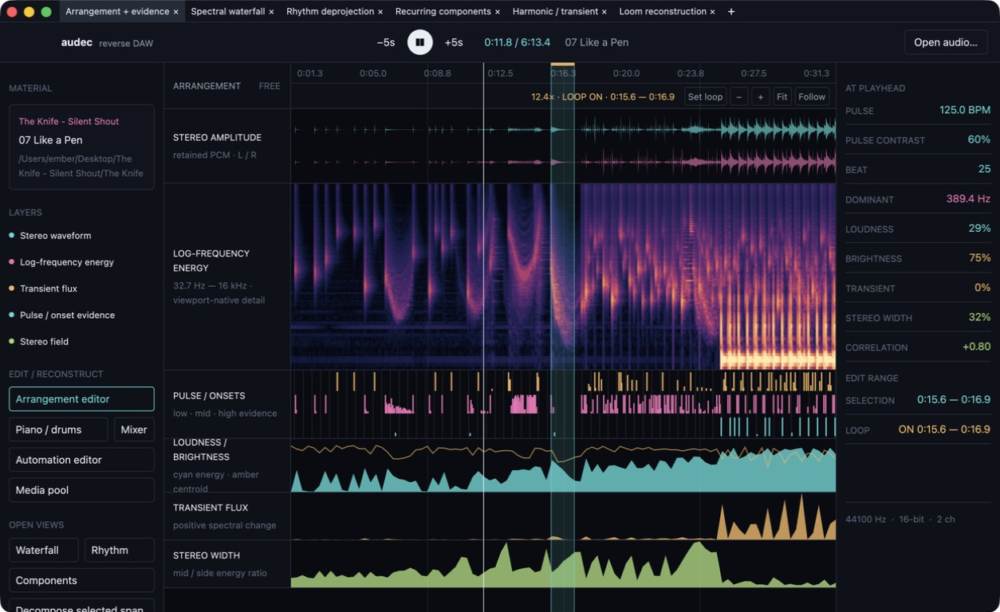

# audec

**A reverse DAW for taking recorded sound apart without pretending the evidence is more certain than it is.**



audec is a native, multiwindow audio workbench built with Rust and GPUI. Give it a finished recording and it turns the mix into inspectable measurements, recurring-pattern hypotheses, editable event templates, audible reconstructions, and residuals. The goal is not to claim access to the lost original session. It is to build the most useful explanation of the sound that the evidence supports—and let you listen to where that explanation fails.

> **Project status:** audec is an early macOS alpha under active development. A loaded recording now inhabits a validated aggregate project with dynamic docked/floating views, project-level undo and journal checkpoints, lossless save/recovery, exact ranged sampling, pads and patterns, deterministic sampler playback, and coherent render publication. The live Project/Library/Investigate/Readings Explorer and six-section Inspector address the same typed objects used by production and reverse-analysis panes; creating a sample, sliced kit, beat, pattern placement, or automation occurrence reveals the exact result instead of ending at a revision badge. Timeline selection, loop, playhead, follow mode, and local viewport are separate state, while Browser and pad audition use authoritative material through an owner-scoped preview bus. Content-addressed render tiles, deeper sampler/pattern/arrangement workflows, reverse working documents, multiwindow session layout, and editable deprojection source programs now have tested foundations; the active Cycle 10 worktree also wires revision-pinned pattern audition, artifact-backed promotion/comparison, reading/query documents, and transactional native workspace authority. Its central acceptance gate and real desktop musician validation are still pending. CLAP execution is an isolated supervised process with a controlled native fixture, not a general third-party compatibility claim; downloaded ML models remain incomplete. It is not yet a replacement for an established DAW or source-separation product.

The project is developed at [ember.software](https://ember.software) and dual-licensed under Apache-2.0 or MIT.

## Why a reverse DAW?

A DAW begins with tracks, notes, automation, effects, and routing, then renders them into audio. audec starts with the audio and works in the other direction:

```text
recording → measurements → events and gestures → patterns and sources
          → editable hypotheses → reconstruction + unexplained residual
```

This is closer to decompilation than transcription. A software decompiler does not recover privileged original source code; it produces a useful intermediate representation with address mappings and uncertainty. In the same way, audec is growing an **Auditory Intermediate Representation (AIR)** whose objects remain linked to the exact samples and transforms that proposed them.

The working loop is:

```text
listen → isolate an aspect → form a claim → test it by ear
       → deproject it into editable structure → rerender → inspect the residual
```

Signal, inference, and experience stay distinct. A spectral peak is not automatically a pitch. Similar attacks are not automatically the same instrument. A low-rank component is not automatically a stem. Descriptions such as “cold,” “approaching,” or “dance-demanding” belong in the system too, but as attributed perceptual readings rather than universal measurements.

## What works today

The current GPUI application provides a synchronized whole-material workbench and five analysis lenses in a Guise tab/split workspace. Lenses preserve their entity state when rearranged and can also open in independent native windows:

- **Workbench atlas** — stereo waveform, log-frequency energy, loudness, spectral centroid, transient, stereo-width and correlation lanes, plus measurements at the shared playhead.
- **Waterfall** — a retained numeric dB field with independent time and log-frequency viewports, adjustable FFT size, window function, dB ceiling, and display range. Analysis settings recompute the field instead of merely stretching an image.
- **Rhythm deprojection** — asynchronous multiband novelty analysis, ranked tempo alternatives, beat/downbeat and pattern-start evidence, anonymous hit families, exact source spans, and auditionable family medoids. Families remain unnamed until stronger evidence exists.
- **Components** — deterministic NMF spectral templates and activation histories presented as recurring mixed-audio hypotheses, with fit information rather than instrument names.
- **Decomposition** — reconstructible, selection-local HPSS with audible original, tonally sustained estimate, transient estimate, and mixture null. Analysis is currently capped at 30 seconds while tiled complex-STFT caching is unfinished.
- **Loom** — aligned, phase-preserving excerpts from recurring attacks deprojected into an editable event sequence. Clusters and events can be muted, shifted, or gain-adjusted; audec immediately overlap-adds a new render and exposes the residual.

The workbench and navigation lenses share playback and seeking while retaining their own view range. They can be paused on a detail, panned independently of transport, zoomed, and asked to follow the playhead again. The workbench timeline has the same independent viewport, sample-accurate selection and looping, and visible-range waveform/feature queries. Its log-frequency lane is regenerated from the exact visible samples at the current pixel width, so zooming reveals new spectral detail instead of stretching a whole-song bitmap. The waveform is backed by a multiresolution min/max/RMS pyramid over retained PCM for the same reason. HPSS and Loom source/construction/residual controls now publish exact-span signals into the shared project renderer: changing what is heard no longer creates a private clock, playhead, or loop. Short templates, pads, and browser samples remain deliberately separate one-shot previews.

Loom is deliberately described as **event-template resynthesis**, not recovered stems. Its templates are excerpts from the mixture and may contain overlapping voices, room sound, and effects. NMF likewise finds recurring structure in a nonnegative time-frequency field; it does not establish source identity.

The same workspace also exposes native production editors:

- **Arrangement** — exact-frame audio, pattern, and automation clips with selection, snapping, independent pan/zoom/follow, source-aware waveform proxies, gesture previews, typed drops, move/trim/split/duplicate/delete, and a provenance inspector. The loaded recording appears as real source material rather than a painted backdrop.
- **Piano roll and drum sequencer** — targetable note and step-pattern views backed by the PPQ sequencer, including pattern lifecycle, trigger bindings, quantize, swing, microtiming-aware scheduling, deterministic performance seeds, and a compact pattern-expression language.
- **Sampler and pads** — exact whole-asset or virtual-range zones, onset-chop previews, keyboard pad banks, typed kit/pad/zone identities, routing and provenance. The engine resolves project material into authoritative sampler voices without guessed instrument identity.
- **Mixer** — semantic gain, pan, mute, solo, inserts, sends and routing actions with command/compatibility modes. Disconnected meters and unexecuted plugin slots remain labeled honestly.
- **Automation** — typed parameter lanes with points, curve shapes, binding modes, compiled-value preview, and gesture-coalesced semantic edits.

The UI-independent `ProjectSession` and `ProjectController` provide one authoritative `DawProject`, revision stream, history, save guard, and action-dispatch surface for the arrangement, mixer, automation editor, media pool, sampler, sequencer, and transport. The visible workbench owns one session entity; arrangement and pattern gestures plus mixer, automation, and sampler actions lower through it instead of mutating domain mirrors. All legacy and dynamic pane instances receive addressed project/audio/selection updates, and workspace import prunes or recreates stale entities instead of leaving them attached to an old project snapshot. A constructive sampling action can publish sample-kit, asset, binding, pattern, arrangement, mixer, and exact PCM changes as one journaled revision and one undo step. Analysis-bearing chop and make-beat preparation runs from immutable snapshots off the UI thread, with a short revision-checked commit. Playback and export consume the same deterministic engine. Completed renders enter a persistent host as coherent revision cohorts; obsolete bounces cannot replace newer work, ordinary edits do not reopen the device, and the rare structural host replacement hands off the exact playhead, mode, and loop.

Project commands now expose Save, Save As, Open, autosave recovery and WAV export through native macOS dialogs. The `.audec` package preserves the dynamic workspace document, constructive domains, unknown extension data and stable identity allocation. This trust path has automated round-trip coverage, but the project remains an alpha: not every visible compatibility editor has completed command-controller migration yet, and real-material workflow checks remain stricter than a green model test.

The current flagship engine regression proves this complete non-UI path with no routing diagnostics:

```text
exact source selection → virtual ranged zone → kit + pad → step pattern
                       → arrangement placement → project mixer → audible PCM
```

The repository contains the UI-independent foundations that these views are being joined onto:

- a sample-accurate project session with typed track, lane, clip, cluster, and event IDs; transport, loop, selection, snapping, revisions, and reversible commands;
- a persistent arrangement model with typed audio, pattern, and automation clips; trim, slip, split, duplicate, fades, stretch metadata, overlap policies, atomic edits, and undo/redo;
- a PPQ sequencer for piano-roll notes, step/drum/sample lanes, tempo and meter changes, quantize, swing, deterministic humanization, ratchets, and exact loop-boundary scheduling;
- realtime-safe compiled automation curves, a validated mixer/routing graph, deterministic offline WAV rendering, and safe plugin scan/runtime contracts;
- a project asset pool with provenance, exact decoded metadata, missing-media handling, duplicate discovery, and deterministic relinking;
- a typed AIR graph for source spans, auditory objects, polyphonic pitch trajectories, parameters, automation, modulation, transforms, relations, evidence, provenance, and competing hypotheses;
- multiresolution constant-Q, multipitch, convolutional-NMF, and multiband rhythm-deprojection engines whose results remain explicitly hypotheses rather than recovered truth.
- deterministic reconstruction proposals that preserve anonymous hit families, competing pitch/modulation implementations, microtiming, full-source residuals, evidence, confidence, and caveats;
- built-in polyphonic subtractive synthesis and sample playback with exact scheduling, bounded voices, and allocation-free block rendering after construction;
- a versioned portable project envelope with atomic saves, autosave recovery, asset-route intent, validation, and explicit domain-codec boundaries;
- a provenance-pinned offline model registry and worker boundary: installed artifacts are hash-verified, and missing models remain an explicit user-download state.

## Getting started

audec's supported alpha runtime target is currently macOS. Linux is a developer
preview: Ubuntu CI compiles the whole GPUI application, opens its real main
window under virtual X11 with Mesa software Vulkan, and executes native CLAP
DSP in an isolated subprocess. Wayland, portals, physical audio devices, and
packaging are not yet runtime-certified; see
[Linux support status](docs/LINUX_SUPPORT.md). On macOS, GPUI uses Apple’s Metal
stack, so you will need a current stable Rust toolchain and Xcode Command Line
Tools.

```sh
git clone https://github.com/emberian/audec.git
cd audec
cargo run --release -- "/path/to/material.flac"
```

The analysis path currently accepts FLAC. You can also launch without a path and choose **Open audio…** or press `⌘O`.

macOS may reject direct command-line access to files in Desktop, Documents, or other protected folders. Opening the file through audec’s native picker grants the appropriate access for that run.

To build a local app bundle:

```sh
cargo build --release
scripts/bundle-macos.sh release
open target/Audec.app
```

The bundle identifier is `software.ember.audec`.

## Interaction reference

### Workbench

| Input | Action |
| --- | --- |
| `Space` | Play or pause |
| `←` / `→` | Seek backward or forward five seconds |
| `⌘O` | Open an audec project |
| `⌘⇧O` | Open FLAC material |
| `⌘S` / `⌘⇧S` | Save / Save As |
| `⌘E` | Export WAV |
| `⌘1` | Open Waterfall |
| `⌘2` | Open Rhythm and recurrence |
| `⌘3` | Open recurring Components |
| `⌘4` | Open HPSS Decomposition around the playhead |
| `⌘5` | Open Loom around the playhead |
| `⌘6` | Open the arrangement editor |
| `⌘7` | Open the piano-roll / drum sequencer |
| `⌘8` | Open the mixer |
| `⌘9` | Open the automation editor |
| `⌘B` | Open the project media pool |
| Click the timeline | Seek on release without changing play/pause state |
| Drag the timeline | Select an exact sample range without moving the transport |
| `=` / `-` | Zoom the arrangement in or out around the playhead |
| `Shift-←` / `Shift-→` | Pan independently of playback |
| Mouse wheel / `Shift`-wheel | Pan the arrangement horizontally |
| `0` | Fit the whole material |
| `F` | Re-enable playhead follow |
| `⌘L` | Set and enable the loop from the selection |
| `L` | Toggle the loop |
| **Make sample** | Turn the selected source range into an exact ranged sample and reveal its Instrument/Pad |
| **Slice to kit** | Create and reveal an eight-pad Instrument from the selected range |
| **Make beat** | Create samples, pads, an editable step pattern and placed occurrence, then reveal the requested destination |

### Popout lenses

| Input | Action |
| --- | --- |
| `Space` | Play or pause the shared transport |
| `←` / `→` | Seek backward or forward five seconds |
| `=` / `-` | Zoom the local time viewport in or out |
| `Shift-←` / `Shift-→` | Pan the local time viewport |
| Mouse wheel or trackpad scroll | Pan the local viewport without moving playback |
| `0` | Fit the whole material |
| **Follow** | Center on the playhead and resume following it |

Manual pan or zoom disengages follow mode. In Waterfall, `FFT−` / `FFT+` and **Win** recompute the spectrum; `F−` / `F+` change the frequency viewport; and `D−` / `D+` and `R−` / `R+` change the dB ceiling and range from retained numeric values. In Decomposition, **Analyze view** reruns HPSS for the visible span. In Loom, the audition controls compare the source mix, reconstruction, residual, and selected template.

## Architecture

audec keeps numerical work, project truth, and GPU presentation separable:

```text
FLAC source
  └── retained PCM + waveform pyramid
      ├── whole-material measurements and spectral field
      ├── pulse, onset, recurrence, and NMF hypotheses
      ├── selection-local complex STFT + HPSS
      └── recurrence events → Loom templates → render + residual

Project session + Auditory IR
  └── GPUI workbench and synchronized native lens windows
```

The main implementation areas are:

| Path | Responsibility |
| --- | --- |
| `src/ui.rs` | GPUI workbench, transport UI, popout lenses, and visual interaction |
| `src/analysis.rs` | FLAC decoding, whole-material measurements, spectral projection, rhythm and recurrence hypotheses |
| `src/pyramid.rs` | Retained PCM and multiresolution waveform queries |
| `src/decomposition.rs` | Deterministic nonnegative matrix factorization |
| `src/hpss.rs` | Phase-preserving STFT, soft-mask HPSS, inverse synthesis, and null measurement |
| `src/loom.rs` | Recurrence-template inference, editable events, overlap-add rendering, and fit metrics |
| `src/session.rs` | Sample-accurate arrangement state, stable IDs, selection, snapping, and undo/redo |
| `src/arrangement.rs` | Persistent typed tracks/clips and non-destructive DAW edit transactions |
| `src/arrangement_view.rs` | Native exact-frame arrangement editor |
| `src/sequencer.rs` | Tempo/meter map, piano-roll and step patterns, and exact event scheduling |
| `src/sequencer_view.rs` | Piano-roll and drum/step editing UI |
| `src/automation.rs` | Typed parameter targets and immutable realtime automation compilation |
| `src/mixer.rs` | Routing, buses, sends, inserts, latency, and mixer edit history |
| `src/control_views.rs` | Mixer and automation editing UI |
| `src/assets.rs` | Project media pool, provenance, missing media, search, and relinking |
| `src/asset_view.rs` | Searchable media-pool UI with provenance and usage inspection |
| `src/audio.rs` / `src/audio_host.rs` | Sample-exact transport plus independent project and audition buses |
| `src/render.rs` | Deterministic offline rendering, residual checks, and WAV export |
| `src/daw_render.rs` / `src/daw_engine.rs` | Immutable aggregate render schedules and audible project rendering |
| `src/project_controller.rs` / `src/constructive_controller.rs` | Authoritative aggregate commands, journaling, undo/redo, exact runtime PCM, and atomic sampling plans |
| `src/project_session.rs` / `src/project_audio_controller.rs` | Project events plus cancellable, generation-checked render publication into one persistent host |
| `src/pane_session_binding.rs` / `src/selection_aspect_service.rs` | Addressed project/audio/selection delivery and linked aspect/signal propagation without pane-owned truth |
| `src/object_navigation.rs` / `src/project_reveal.rs` | Typed product-object reveal, pane targeting, and undo/import-safe completion guards |
| `src/pane_audio.rs` | Timeline-versus-preview audio classification plus owner/generation-safe sample and pad audition |
| `src/transport_handoff_controller.rs` | Exact playhead, mode, and loop preservation across rare structural host replacements |
| `src/live_project.rs` | Aggregate publication bridge, validation, ownership migration, decoded PCM, and audition compilation |
| `src/export.rs` | Atomic, deterministic PCM16/PCM24/float WAV export with progress and cancellation |
| `src/instruments.rs` | Built-in sampler and polyphonic subtractive synthesizer DSP |
| `src/sampler_runtime.rs` / `src/sampler_view.rs` | Authoritative kit/pad/zone resolution, ranged PCM voices, pad audition, chopping, and zone editing |
| `src/pattern_lang.rs` / `src/pattern_authoring.rs` | Pure pattern terms, exact-rational evaluation, retained origin, cycle semantics, and divergence |
| `src/plugin.rs` | Safe plugin discovery, state, ports, automation, and process-boundary contracts |
| `src/rhythm.rs` | Multiband onset, tempo ambiguity, beat/downbeat, hit-family, and pattern evidence |
| `src/cqt.rs` / `src/pitch.rs` / `src/nmfd.rs` | Constant-Q, pitch/modulation evidence, and recurring component hypotheses |
| `src/ontology.rs` | Typed AIR objects, pitch, transforms, modulation, evidence, provenance, and alternatives |
| `src/reconstruction.rs` | Ranked editable reconstruction proposals with uncertainty and residuals |
| `src/reconstruction_apply.rs` | Atomic promotion of selected proposals into typed arrangement, sequencer, automation, mixer, and residual material |
| `src/project_repository.rs` / `src/project_io.rs` / `src/project_codecs.rs` | Portable project packages, lossless constructive payloads, dynamic workspaces, atomic saves, autosave, and recovery |
| `src/comparison_runtime.rs` / `src/comparison_controller.rs` | Exact source/construction/residual execution, coverage/excess artifacts, aligned audition, and render products |
| `src/rhythm_explanation.rs` / `src/rhythm_promotion.rs` | Anonymous generative explanations and atomic rhythm-evidence promotion into samples, pads, patterns, and placements |
| `src/model_task_service.rs` / `src/model_registry.rs` / `src/model_worker.rs` | Verified optional-model artifacts, isolated execution, cancellation, cache restoration, and claim publication |
| `src/timeline.rs` | Transport-independent sample-coordinate viewport mechanics |
| `src/spectral_tiles.rs` | Visible-range, pixel-aware spectral analysis and bounded tile caching |
| `src/workspace.rs` | Stable dock/tab/tear-off layout model and persistence |
| `src/settings.rs` | Typed analysis and lens parameters, including retained settings from the original audec |

The original SDL/PortAudio views remain under `src/view/` as reference implementations while their useful controls and behavior are rebuilt as typed GPUI lenses. They are not part of the current application target.

For the complete epistemic model and workspace design, read [docs/VISION.md](docs/VISION.md). The concrete “roughly 85% of LMMS plus reverse-DAW advantages” acceptance gates live in [docs/LMMS_PARITY_ROADMAP.md](docs/LMMS_PARITY_ROADMAP.md), with a ranked interaction audit in [docs/UX_WORKFLOW_AUDIT.md](docs/UX_WORKFLOW_AUDIT.md). Optional model-worker strategy and audited decomposition candidates are documented in [docs/ML_MODELS.md](docs/ML_MODELS.md).

## Development

```sh
cargo fmt --check
cargo test
```

The test suite covers analysis primitives, waveform resolution, deterministic NMF, reconstructible STFT/HPSS, Loom inference and rendering, settings normalization, sample-coordinate timeline behavior, session history, and AIR graph validation. The development profile intentionally enables modest optimization because whole-track FFT and clustering work is otherwise unrepresentatively slow.

When adding an analysis result, preserve three things:

1. its exact backlink to source samples;
2. the parameters, implementation or model identity, and provenance that produced it;
3. an audible or measurable way to challenge the claim, ideally including its complement or residual.

## Roadmap

- **Converge the playable desk** — finish lowering every arrangement, sampler, pattern, mixer and automation gesture through the authoritative controller; polish direct manipulation; make save/reopen/export and edit-while-looping pass on real material.
- **Fuse reverse and forward** — deproject anonymous hit families into ordinary samples and generative patterns, edit them as music, and hear the source/construction/residual comparison update through the same renderer.
- **Make explanations navigable** — persistent comparison strips, explained/excess-energy coverage, evidence inspection, shared aspects and link groups, and residual-guided AIR queries.
- **Add optional intelligence honestly** — Beat This and IDM workers first, then separation, pitch, sample and patch proposal models; all outputs remain versioned competing claims with audible evidence and explicit failure.
- **Earn DAW muscle memory** — real meters and automation DSP, incremental render tiles, stem export, richer instruments/effects, safe plugin hosting, MIDI and eventually recording, plus the LMMS-parity acceptance corpus.
- **Share readings** — portable source-verified interpretations, structural diff/merge, explain-as-expression, and a headless command/query/render protocol.
- **Perceptual instruments** — agency and grouping alternatives, personal descriptive lexicons, and explicit crossmodal/vEAR bindings.

The design test is simple: every mark should answer **what evidence is this, how was it derived, can I hear it, and what happens if I edit it?**

## License

Dual-licensed under [Apache-2.0](LICENSE.APACHE2) or [MIT](LICENSE.MIT), at your option.
